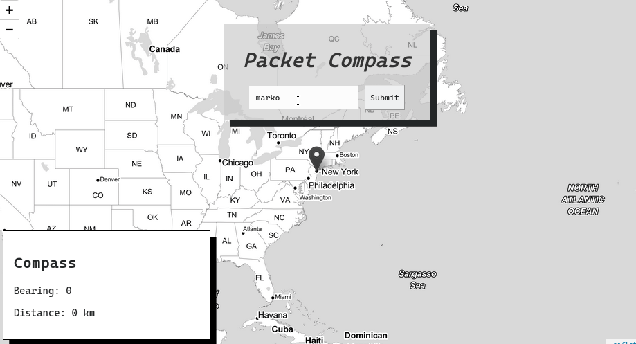

# Packet Compass


Packet Compass is a traceroute map visualizer that plots the geo-coordinates on a map and provides geospatial analysis on the ip addresses such as bearing and distance to the client.

It is run with:
- node.js
- node-traceroute
- leaflet.js
- turf.js
- GeoIPLite

## Prerequisites

Before you begin, ensure you have met the following requirements:

* You have installed a version of node.js installed
* You have [traceroute](https://www.howtogeek.com/657780/how-to-use-the-traceroute-command-on-linux/) installed (tested on Linux)
* A copy of [GeoIPLite](https://dev.maxmind.com/geoip/geoip2/geolite2/) downloaded (a version is included in the repo)
* Enable geolocation on your client device

## Installing Packet Compass

To install please run:
```
git clone https://github.com/emceelamb/compass.git
cd compass
npm install
```


## Using Packet Compass

To use Packet Compass, follow these steps:

Development: `npm test`  
Deployment: `npm start`


